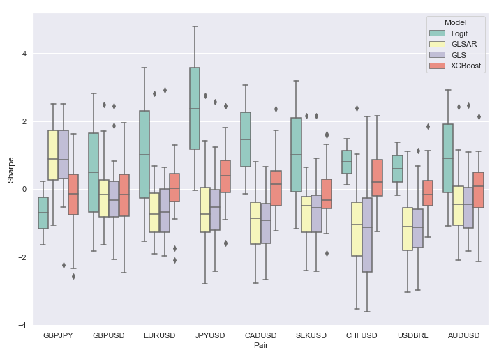
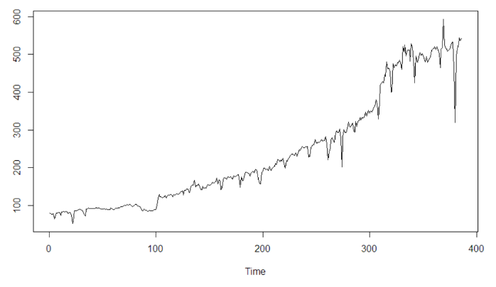
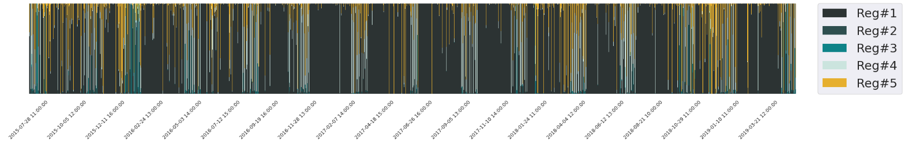

  
  # Ilies El Jaouhari 
  
  ## Master of Science in Applied Mathematics | Data Scientist | Quantitative Analyst

  

  <a href="https://github.com/IliesElJ">Github</a> •
  <a href="https://www.linkedin.com/in/ilies-el-jaouhari">LinkedIn</a> •
  <a href="mailto:ilies.eljaouhari@ensae.fr">Email</a>

## 🎓 Introduction

Hi there! My name is **Ilies El Jaouhari**, a Master of Science in Applied Mathematics candidate at [ENSAE](https://www.ensae.fr/en/) in Paris, France. I'm also a Research Assistant at the Center for Research in Economics and Statistics ([CREST](https://crest.science/)), where I'm investigating the benign overfitting phenomenon in classification models. I'm passionate about finance and data science, particularly in creating robust quantitative models and algorithms for financial data analysis.

I'm intrigued by the potential of innovative statistical and machine learning techniques in uncovering insights into financial markets and devising effective investment strategies. You can find more about my work and experiences below.

## 💼 Experience

#### 🔬 Research Assistant | [ENSAE, CREST](https://crest.science/)
> Under the mentorship of Guillaume Lecué, my work revolves around developing bounds for excess risk in classification estimators.

#### 📊 Data Science Intern | [Ardian Infrastructure](https://www.ardian.com/fr/infrastructure)
> My role included building models for short-term expected energy production at several Italian and Spanish wind farms using neural networks and gradient boosting. Additionally, I worked on estimating the total carbon emissions from Portuguese highway networks using state-of-the-art methodologies.

## 🎨 Projects

  
#### [Predicting movements in the foreign exchange market with QuantCube Technology](https://github.com/IliesElJ/Forex)
  

#### [Gross Industrial Production Index Forecasting with SARIMA Models](https://github.com/IliesElJ/SARIMA)
  

#### [Modeling Market Regimes using GMM](https://github.com/yourusername/project3)

## 💡 Skills

- **Programming languages:** Python, R, MATLAB
- **Statistical analysis:** Regression analysis, Time series analysis, Hypothesis testing
- **Machine learning:** Supervised learning, Unsupervised learning, Deep learning
- **Financial modeling:** Option pricing, Portfolio optimization, Risk management
- **Quantitative finance:** Experience analyzing and backtesting trading strategies on multi-asset portfolios in Python on **[QuantConnect](https://www.quantconnect.com/)**, and running them live.

## 📫 Contact
Interested in collaborating or just have a question? Feel free to contact me at **ilies.eljaouhari@ensae.fr**.

  **Ilies El Jaouhari** 
  ENSAE | CREST
  

