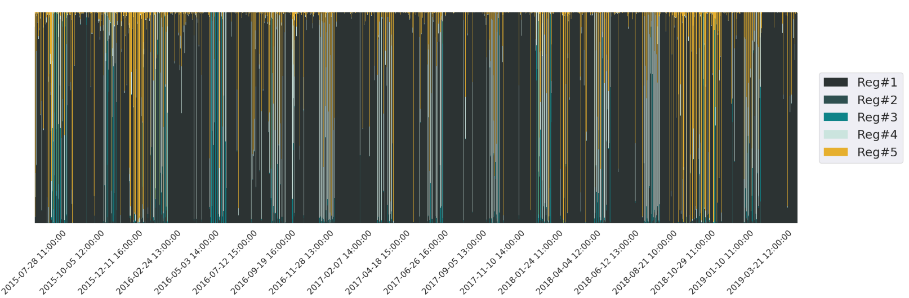

# Introduction

My name is Ilies El Jaouhari, and I am a Master of Science in Applied Mathematics candidate at École Nationale de la Statistique et de l'Administration Économique (ENSAE) in Paris, France. I am currently a Research Assistant at the Center for Research in Economics and Statistics (CREST) working on the benign overfitting phenomenon in classification models. My research interests lie at the intersection of finance and data science, with a focus on developing robust quantitative models and algorithms to analyze financial data. Specifically, I am interested in exploring innovative statistical and machine learning techniques to gain insights into financial markets and create effective investment strategies.

# Experience

- **[ENSAE, CREST](https://crest.science/)** (Research Assistant): Under the supervision, I am focusing on developing  bounds for excess risk of classification estimators.

- **[Ardian Infrastructure](https://www.ardian.com/fr/infrastructure)** (Data Science Intern): Worked on Data Science projets linked to assets from Ardian Infrastructure’s portfolio on Microsoft Azure. Built and deployed models estimating
the expected energy production of numerous Italian and Spanish wind farms in the short‑term, using neural networks and gradient boosting
algorithms on production signals and weather forecasts from ECMWF. Worked on the estimation of the total carbon emissions from Portuguese
highway networks following state‑of‑art methodology.

# Projects
Here are some of the projects that I've worked on:

- **[With QuantCube Technology, Predicting movements in the foreign exchange market](https://github.com/IliesElJ/Forex)**: In this project, we used Python to predict movements in the foreign exchange market by analyzing the statistical impact of several macroeconomic variables (provided by QuantCube) on currency exchange rates. We conducted statistical tests to identify the most significant variables and developed trading strategies based on our insights. We evaluated the effectiveness of these strategies through backtesting. The goal of this project was to explore the potential of using quantitative methods to improve foreign exchange trading strategies.

- **[Gross Industrial Production Index Forecasting with SARIMA Models](https://github.com/IliesElJ/SARIMA)**: This project involved stationnarizing, fitting and predicting the gross industrial production index time series using SARIMA models. We analyzed the data for seasonality and trends, and selected appropriate parameters for the SARIMA models based on autocorrelation/partial autocorrelation plots and Akaike/Bayesian information criterions. We used the fitted models to make forecasts for future time periods and evaluated their accuracy through backtesting. The goal of this project was to develop a reliable forecasting model for the gross industrial production index time series.

- **[Modeling Market Regimes using GMM](https://github.com/yourusername/project3)**: This project involved using GMM to model market regimes in various financial markets by using statistical tests, AIC and BIC to determine the optimal number of regimes and the appropriate parameters for the GMM models. I then used the GMM to identify different market regimes (in the case of the 2 Gaussian distributions: High/Low volatility regimes). The goal of this project was to develop a reliable framework for modeling market regimes.

# Skills
Here are some of the skills that I have developed during school or on personal projects:

- Programming languages: Python, R, MATLAB
- Statistical analysis: Regression analysis, Time series analysis, Hypothesis testing
- Machine learning: Supervised learning, Unsupervised learning, Deep learning
- Financial modeling: Option pricing, Portfolio optimization, Risk management
- Quantitative finance: Experience analyzing and backtesting trading strategies on multi-asset portfolios in Python on **[QuantConnect](https://www.quantconnect.com/)**, and running them live.

# Contact
If you have any questions or would like to collaborate on a project, feel free to contact me at **ilies.eljaouhari@ensae.fr**.

